# runtime-new — new features storyboard

Visual story-board for the four new things added on top of the
original Kree pledge ritual:

1. The **breathe-in / breathe-out** animation behind the intro text.
2. The **dark / light theme toggle** in the header.
3. The **donation wizard** — the user picks how to act on the pledge
   (donate time vs donate resources), then picks a specific option,
   then confirms.
4. The **thank-you / start-again** screen at the end.

The original pledge ritual itself is captured in
[`../runtime-old/`](../runtime-old/); this folder is *only* the
new work.

## A. Breathe orb

The orb pulses behind "Pause." (expanding) and "Take a breath."
(contracting). Captured here on a dark background and again on a
light background.

| Frame | What it shows                                                                  |
|-------|--------------------------------------------------------------------------------|
| 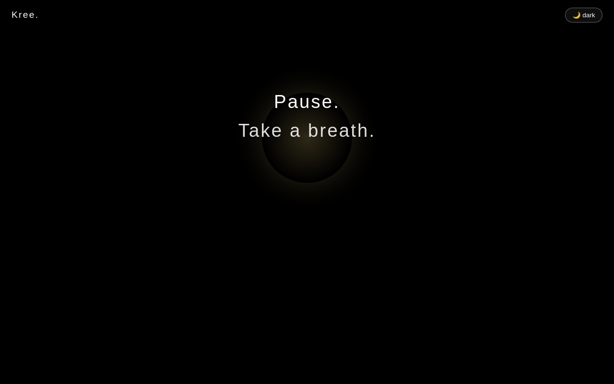 | `01-breathe-in-dark.png` — orb at peak inhale, dark theme    |
| 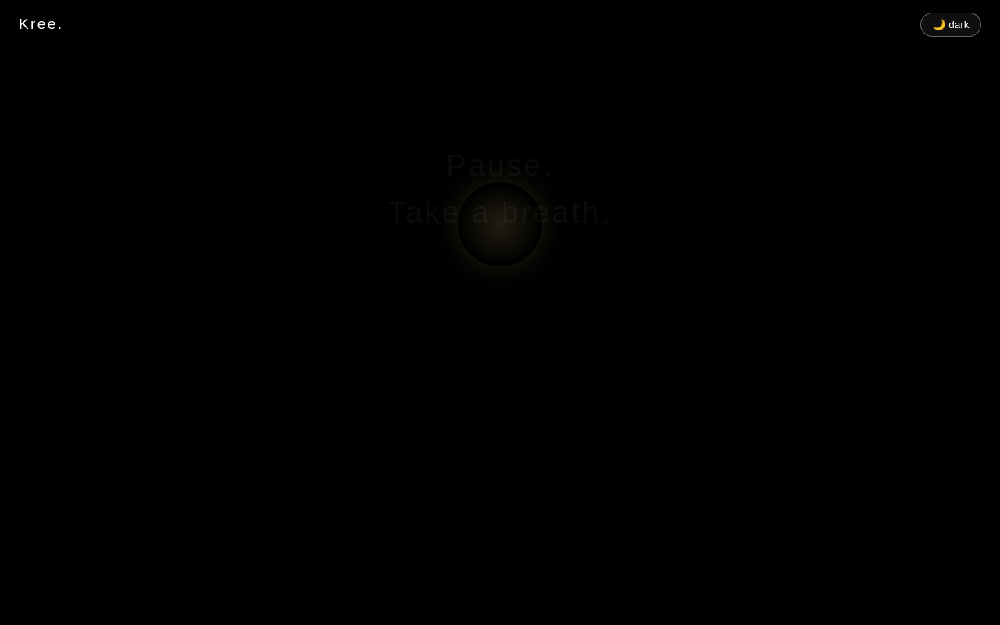 | `02-breathe-out-dark.png` — orb contracted on exhale       |
| 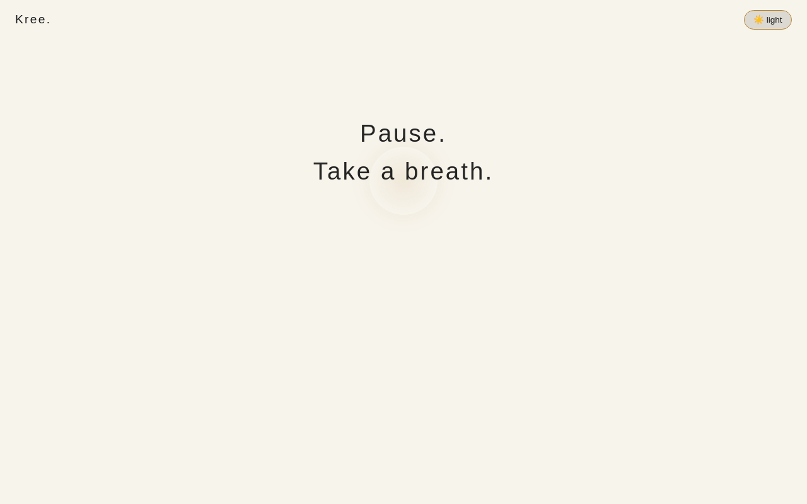 | `05-breathe-light.png` — same orb against the light theme    |

Implementation lives in
`src/app/kree/this-moment/this-moment.component.{ts,html,css}`. The
component sets `breathe = 'in'` immediately on `ngOnInit` and flips
to `'out'` when the "Take a breath." line appears, then `'idle'`
when the questions block takes over.

## B. Dark / light theme

The header has a small theme toggle button. Defaults: dark unless a
stored preference or the system says otherwise.

| Frame | What it shows                                                                  |
|-------|--------------------------------------------------------------------------------|
| 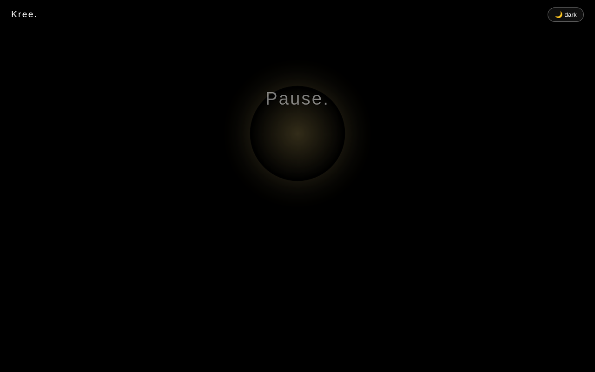 | `03-header-dark.png` — header on the default dark theme          |
| 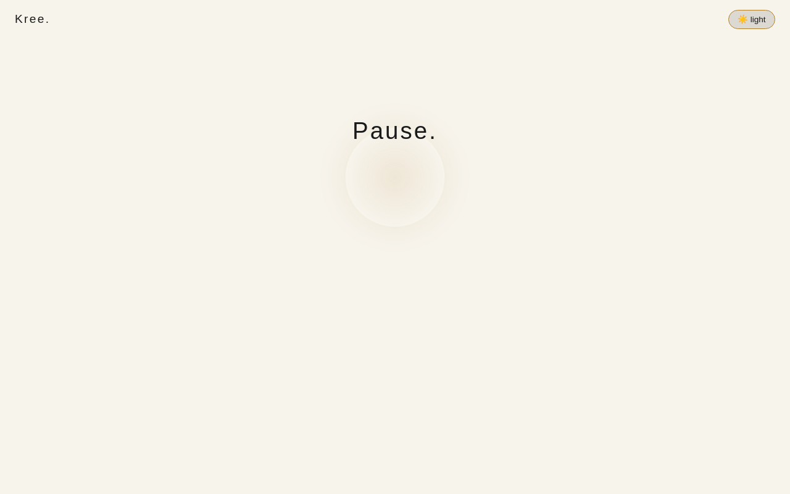 | `04-header-light.png` — same header after pressing the toggle  |

Implementation: `src/app/kree/services/theme.service.ts`. All
component colours come from CSS variables defined in
`src/styles.css` (`--kree-bg`, `--kree-fg`, `--kree-accent`, …).
Switching themes is purely a `data-theme` attribute on `<html>`.

## C. Donation wizard — time branch (dark)

Three steps: kind → option → confirm → thank-you.

| #   | Frame                                          | Step                                            |
|-----|------------------------------------------------|-------------------------------------------------|
| 06  | 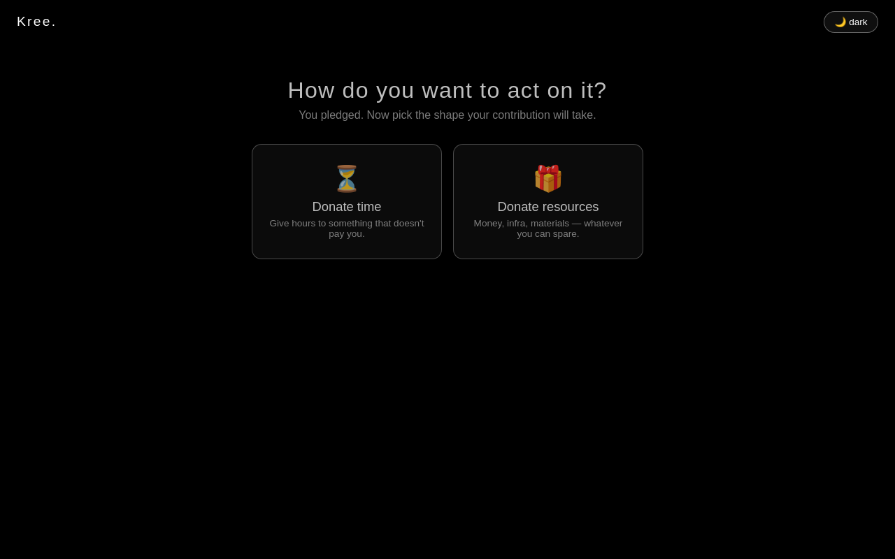                     | Step 1 — pick *time* or *resources*             |
| 07  | 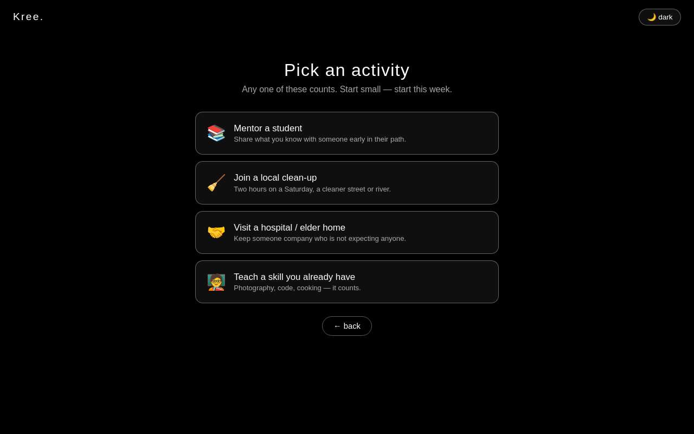                | Step 2 — list of time activities (mentor, clean-up, …) |
| 08  | 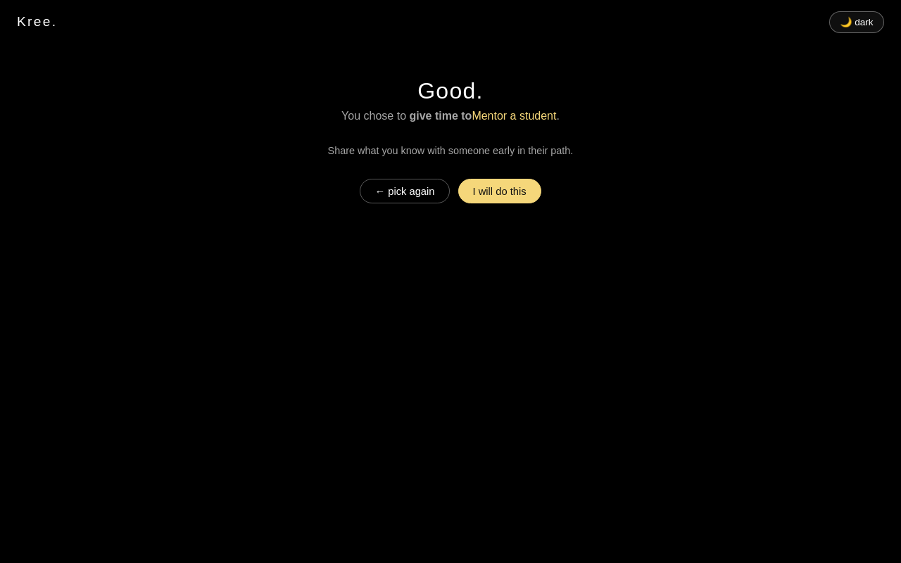        | Step 3 — confirm "Mentor a student"             |
| 09  | 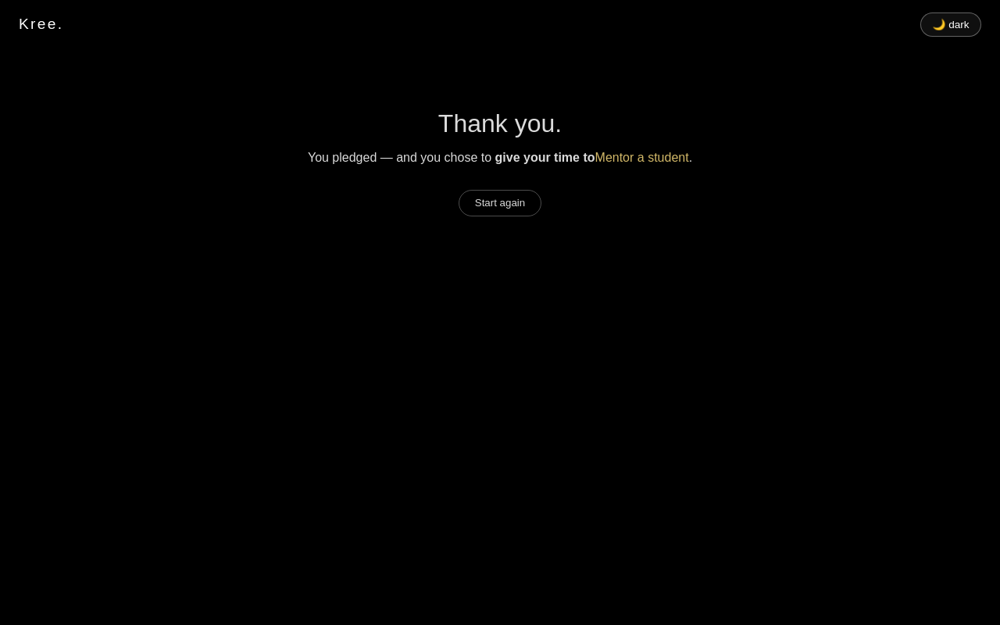                   | Thank-you, with "Start again" button            |

## D. Donation wizard — resources branch (light)

Same wizard, opposite branch, captured against the light theme to
double-document responsive theme support.

| #   | Frame                                                              | Step                                                  |
|-----|--------------------------------------------------------------------|-------------------------------------------------------|
| 10  | 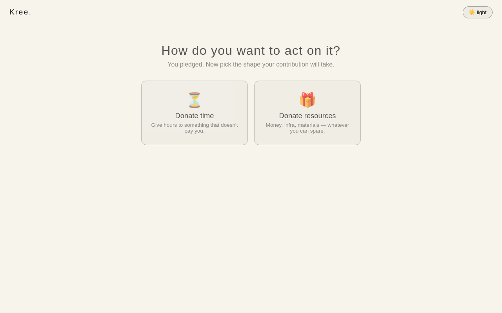                                   | Step 1 — light theme                                  |
| 11  | 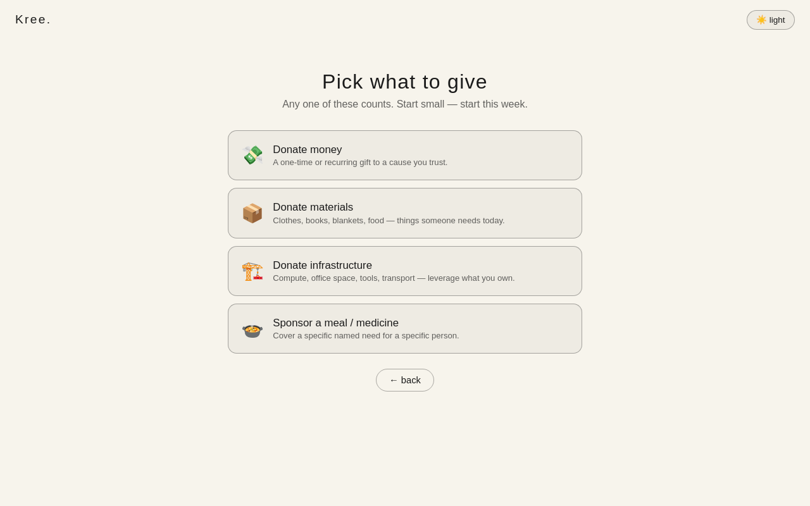                         | Step 2 — list of resources (money, materials, …)      |
| 12  | 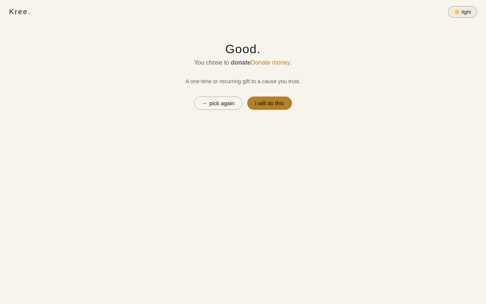                 | Step 3 — confirm "Donate money"                       |
| 13  | 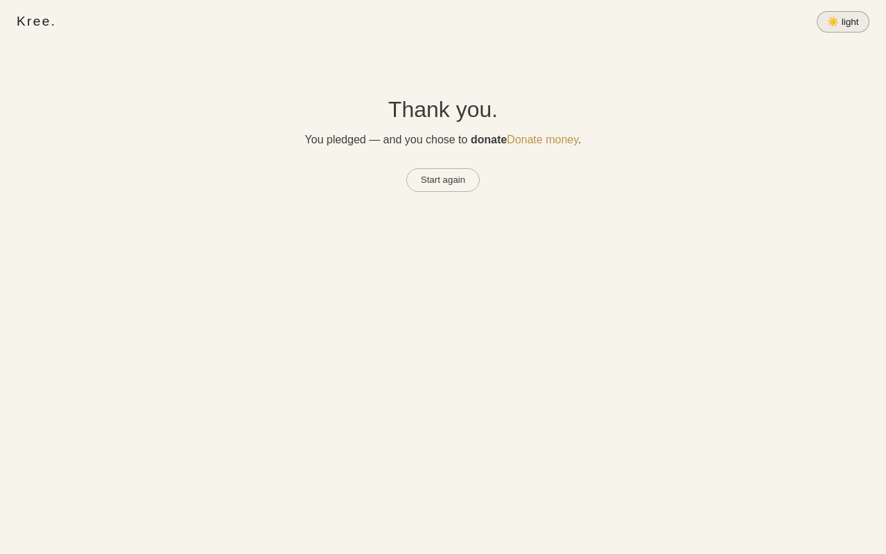                            | Thank-you, light theme                                |

## How to regenerate

```sh
npm run build
node tests-baseline/storyboards.cjs runtime-new
```

The wizard steps each take a few hundred ms to settle so the
animations finish before the screenshot fires. The whole
`runtime-new` capture takes ~3 minutes (most of that is the slow
pre-wizard pledge flow that has to play out twice — once for the
time branch, once for the resources branch).

## Related code

| File                                                                             | Role                                              |
|----------------------------------------------------------------------------------|---------------------------------------------------|
| `src/app/kree/donation-wizard/donation-wizard.component.ts`                      | 3-step wizard state machine                       |
| `src/app/kree/donation-wizard/donation-wizard.component.html`                    | step templates + back/confirm buttons             |
| `src/app/kree/donation-wizard/donation-wizard.component.scss`                    | grid + card styling, theme-aware via CSS vars     |
| `src/app/kree/services/theme.service.ts`                                         | dark/light state + persistence                    |
| `src/app/kree/this-moment/this-moment.component.ts`                              | drives `breathe` flag                             |
| `src/app/kree/this-moment/this-moment.component.css`                             | `kreeBreatheIn` / `kreeBreatheOut` keyframes      |
| `src/app/kree/kree.component.{ts,html,css}`                                      | header, theme toggle, wizard plumbing, thank-you  |
