# runtime-old — original-equivalent flow

Visual storyboard of the **Kree pledge ritual** as it existed in the
original Angular 2 codebase, captured from the Angular 17 port. This
folder demonstrates **all flows of the application that existed
before any new features were added**: the intro pause/breath, the
three questions, the take-pledge button, the multi-script "I" cycle,
the name input, and the typed-out pledge.

The original Angular 2 starter cannot be built on a modern Node /
Angular CLI, so these screenshots are taken from the upgraded build
configured to behave like the original — i.e. the donation wizard
and theme toggle are present in the app but **not exercised in this
storyboard**. They are documented separately under
[`../runtime-new/`](../runtime-new/).

The breathe-orb is *visible* in these frames (it sits behind
"Pause." and "Take a breath."). That is intentional — the orb is a
new visual but the original screen had a candle GIF in roughly the
same role, so showing it here is more faithful than hiding it.

## Frames (in playback order)

| #   | Frame                                                                  | What it shows                                                |
|-----|------------------------------------------------------------------------|--------------------------------------------------------------|
| 01  | 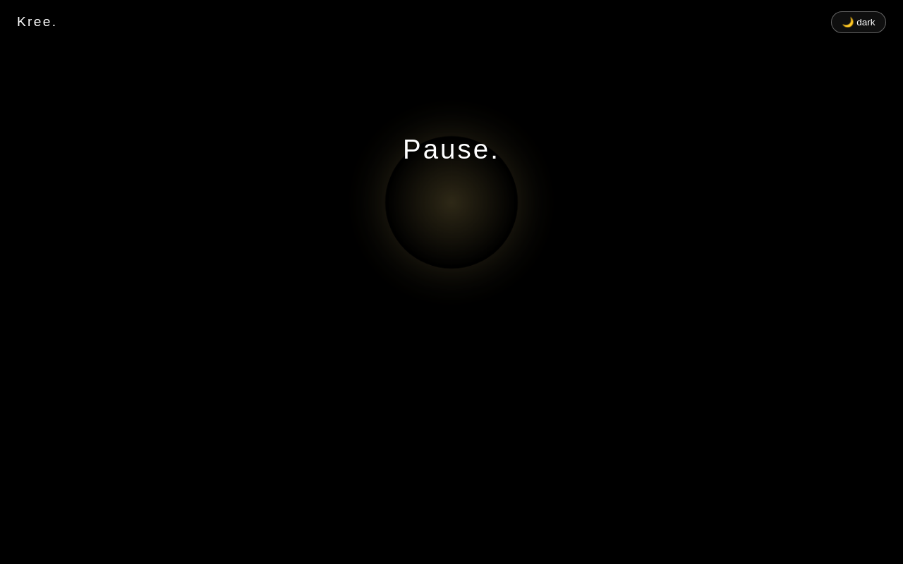                                                 | "Pause." fades in. Breathe-in orb is expanding behind it.    |
| 02  | 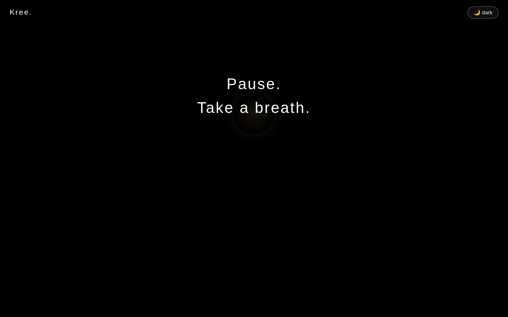                                        | "Take a breath." replaces "Pause."; orb is contracting.      |
| 03  | 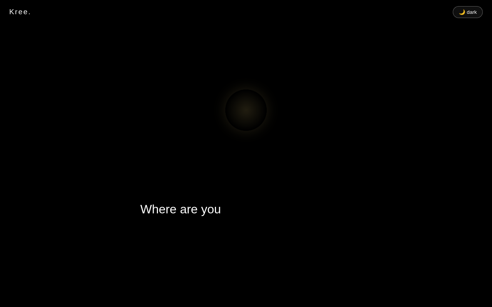                                      | First question — "Where are you" — typing in.                |
| 04  | 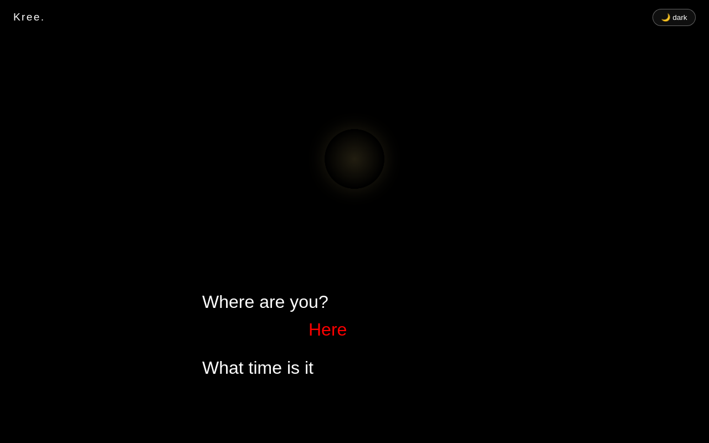                                        | Second question — "What time is it?" — answer "Now".         |
| 05  | 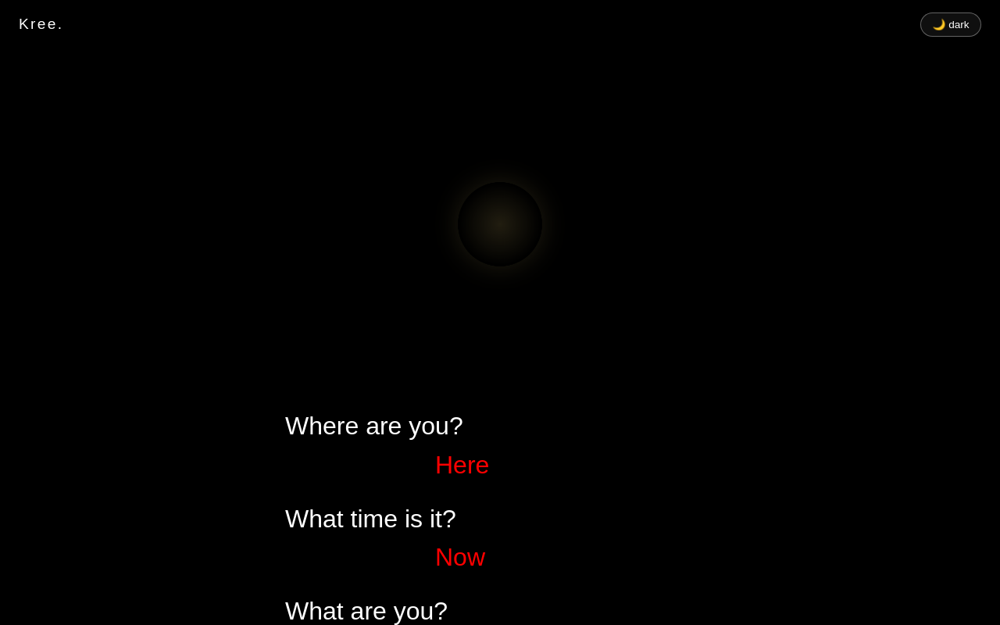                                        | Third question — "What are you?" — answer "This moment".     |
| 06  | 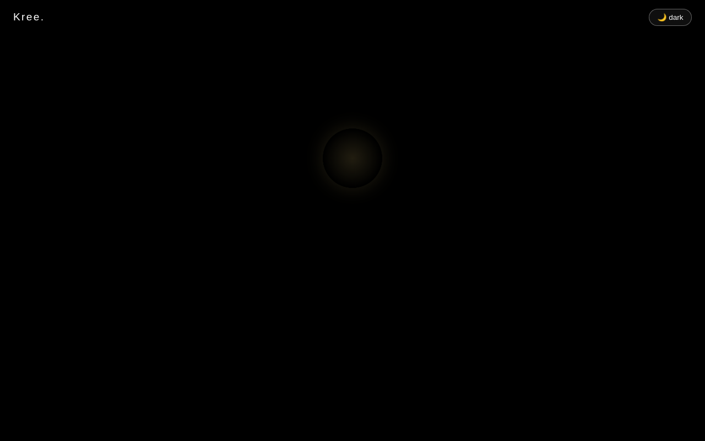                              | The bordered "Take a pledge" button. The user clicks here.   |
| 07  | 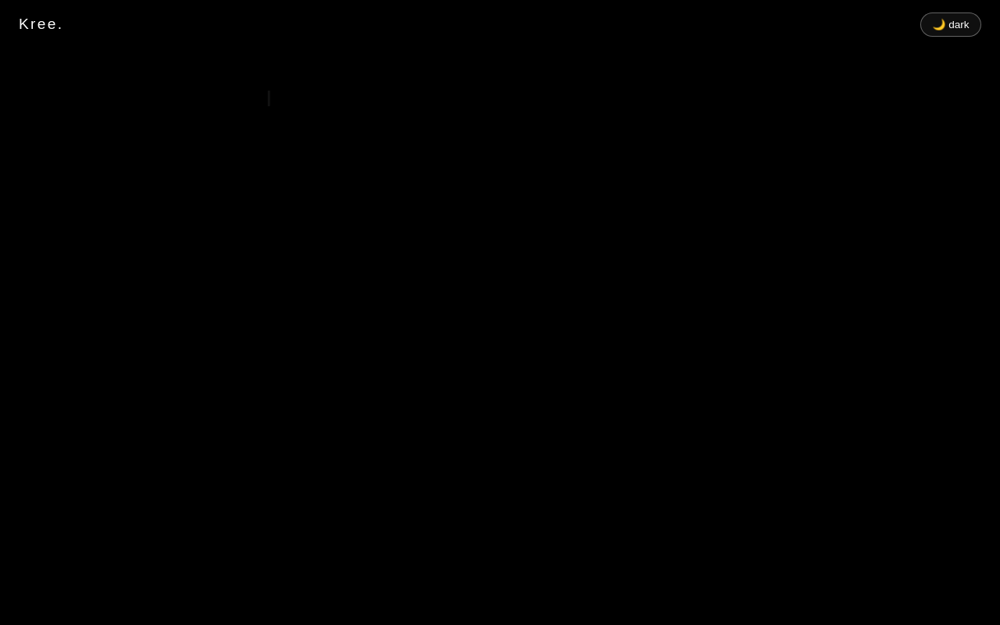                                   | "I" — Latin script. First of the five-language cycle.        |
| 08  |                          | "मैं" — Devanagari. The cycle continues through Gurmukhi, Kannada, Urdu. |
| 09  | 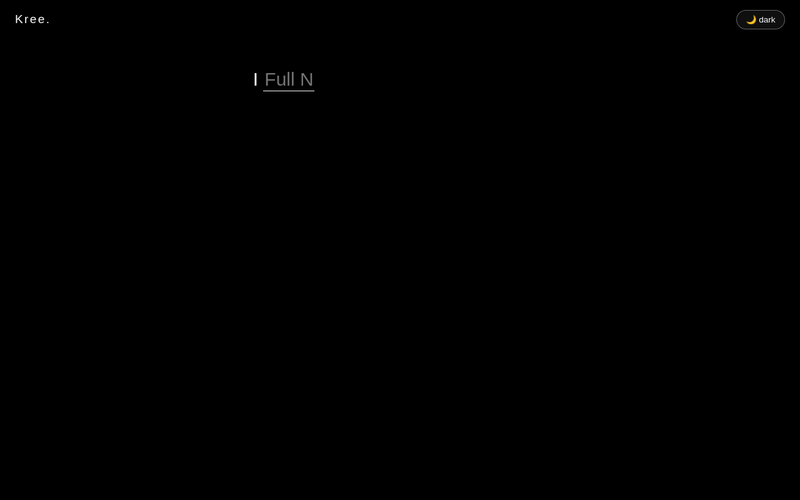                                       | The text input slides out to width 300 px after the cycle.   |
| 10  | 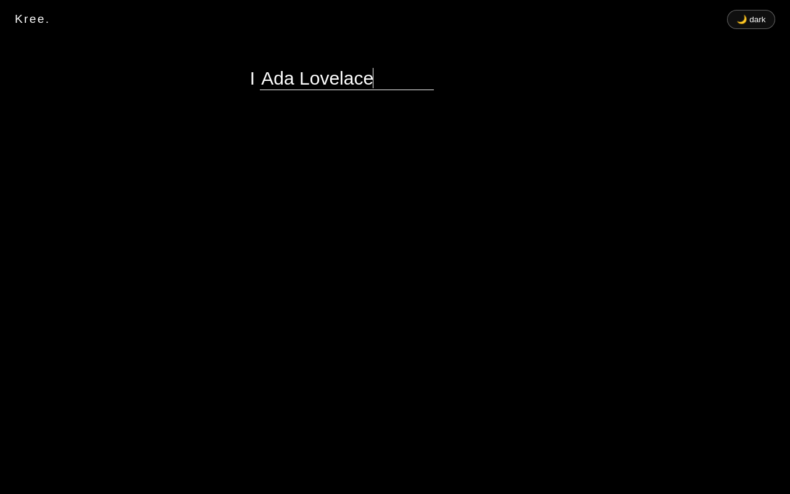                                       | The user types their name (here: "Ada Lovelace").            |
| 11  | 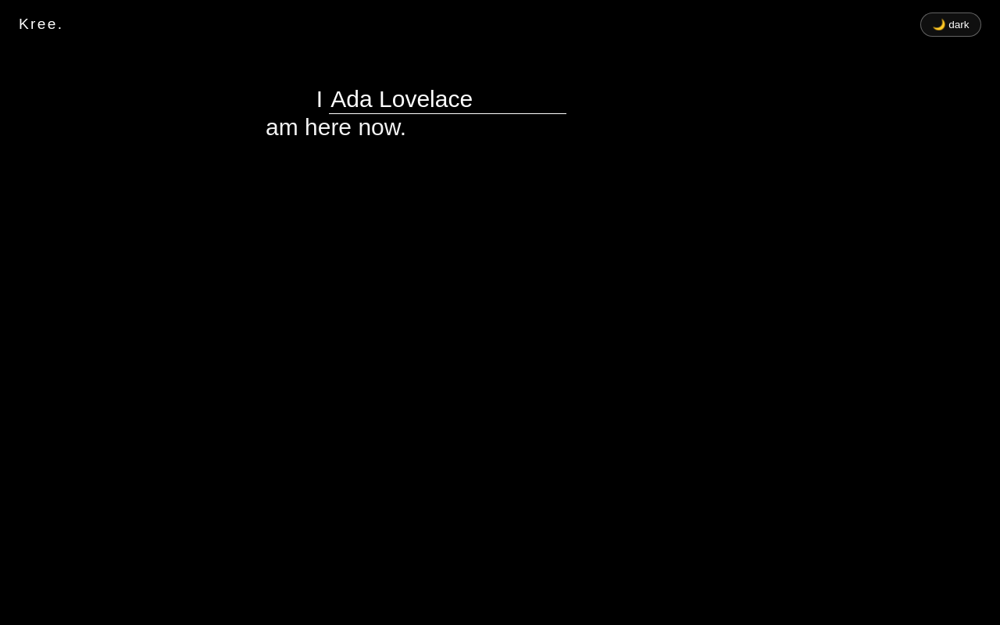                                      | "I … am here now." reveals.                                  |
| 12  | 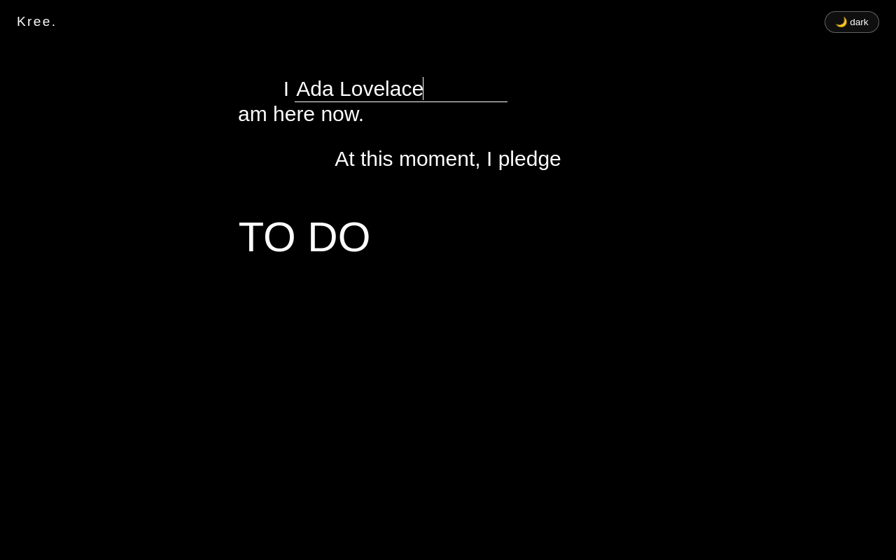                        | Pledge phase begins — "At this moment, I pledge" types out.  |
| 13  | 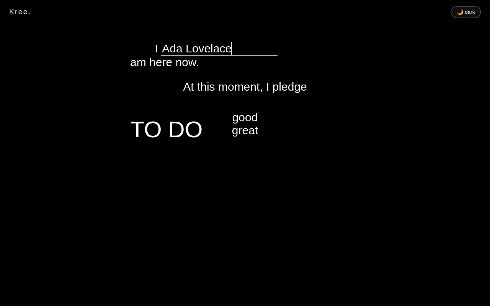                                | "TO DO" drops in; "good" / "great" type out.                 |
| 14  | 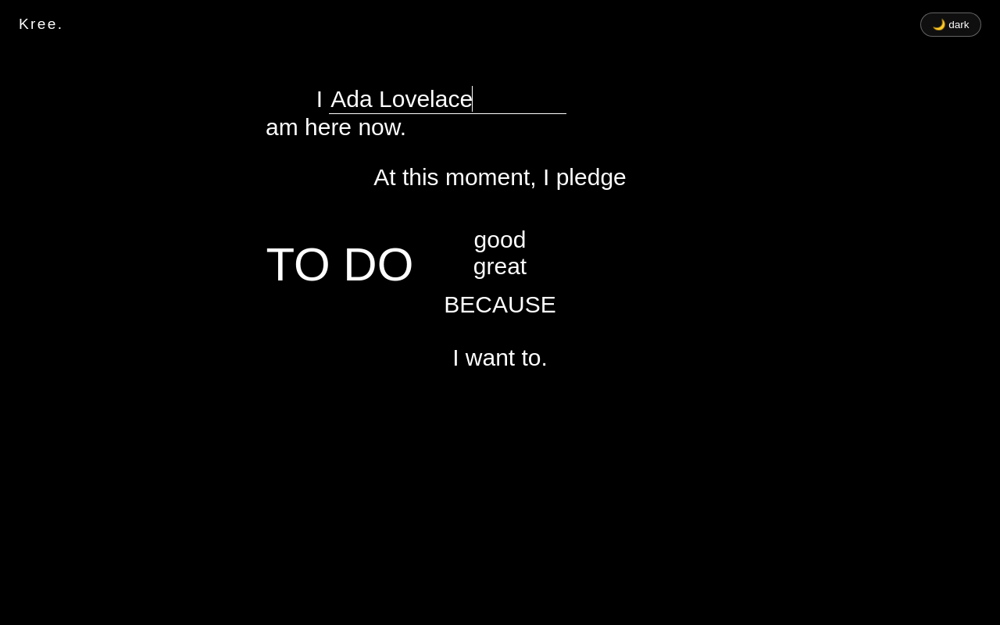                          | "BECAUSE / I can." appears.                                  |
| 15  | 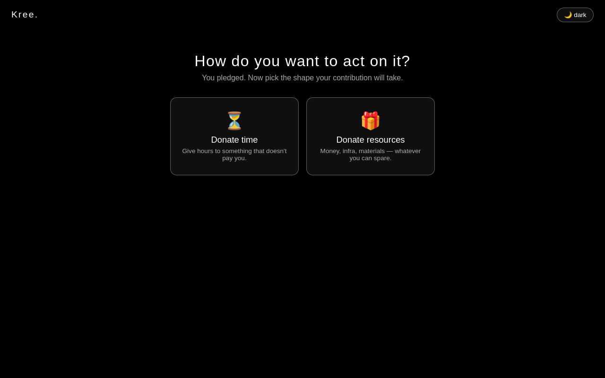                                            | The full pledge stands on screen. End of the original flow.  |

## How to regenerate

```sh
npm run build
node tests-baseline/storyboards.cjs runtime-old
```

The runner does not stub timing — every frame waits real wall-clock
seconds, so the entire `runtime-old` capture takes roughly 90
seconds.
